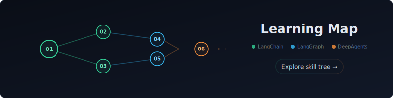

# LangChain Learning

Repo d'apprentissage pour comprendre l'écosystème **LangChain / LangGraph / DeepAgents** à travers des exercices progressifs.

<a href="https://evaneos.github.io/langchain-learning/">
  
</a>

## Hiérarchie des librairies

| Librairie | Rôle | Dépend de | Alternatives |
|-----------|------|-----------|--------------|
| **LangChain** | Framework — abstractions & integrations | — | AI SDK, LlamaIndex, CrewAI |
| **LangGraph** | Runtime — durable execution, streaming, HITL, persistence | LangChain | Temporal, Inngest |
| **DeepAgents** | Harness — predefined tools, prompts, subagents | LangGraph | Claude Agent SDK |

> **LangChain** ➜ **LangGraph** ➜ **DeepAgents**

## Démarrage rapide

```bash
npm install
cp .env.example .env.local   # puis ajouter votre clé ANTHROPIC_API_KEY

# Lancer un exercice
npm run ex -- 05              # exercice 05
npm run ex -- 5 B             # exercice 05, partie B
npm run ex -- 5 B --slow      # avec flags supplémentaires

# Lancer le dernier exercice
npm run latest

# App Next.js (exercices 10+)
npm run dev
```

## Structure

```
exercises/01-*  à  08-*    Exercices progressifs (chacun autonome)
docs/                      Notes théoriques, glossaire, learning map
app/                       App Next.js pour les exercices front (10+)
```

Chaque exercice a un `README.md` (en français) et un `index.ts` exécutable avec `npx tsx`.

## Générer de nouveaux exercices

Les exercices sont conçus pour être générés avec **Claude Code**. Le fichier `exercises/CLAUDE.md` contient les conventions à suivre.

## Roadmap

Voir [`docs/ROADMAP.md`](./docs/ROADMAP.md) pour le plan complet des exercices (Section 1 : Core, Section 2 : Patterns avancés).
